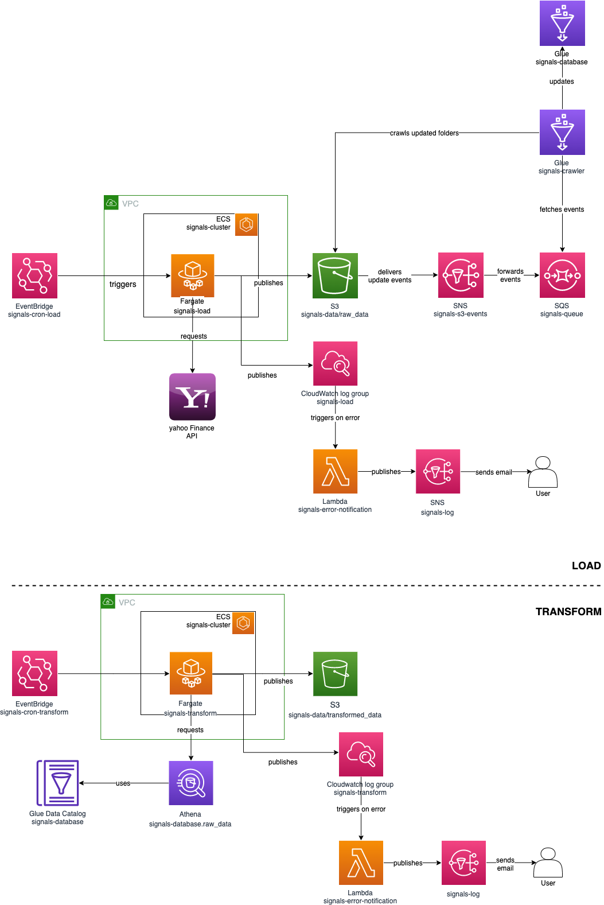
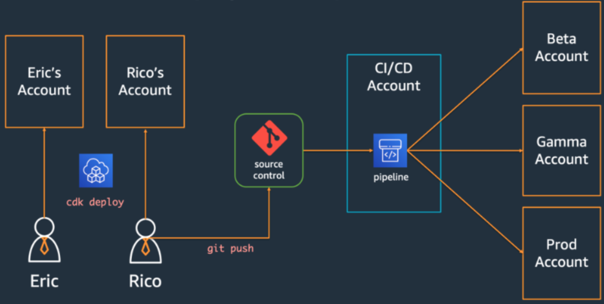

# Numerai Signals

## Outline

This document covers:
- project context
- infrastructure
- package structure
- development
- tasks definitions
- containers
- CI/CD pipeline
- license
- contact

## Project context

In a nutshell, this project is the first stage of our ML pipeline for numerai signals. Visit the [official page](https://docs.numer.ai/numerai-signals/signals-overview) for more information.

It processes financial data that is later used for training our Signals models. Two distinct phases:
- Load: extract financial data from Yahoo Finance and load it into the data lake
- Transform: Transform raw data using technical analysis library

## Infrastructure

We leverage AWS products. The stack contains the following components:

- EventBridge rules `signals-load` & `signals-transform`: trigger the tasks at a fixed schedule
- EC2 VPC `signals-vpc`: host the cluster
- ECS cluster `signals-cluster`: deploy tasks
- Fargate tasks `signals-load` & `signals-transform`: define tasks
- S3 bucket `signal-data`: store data
- S3 bucket `signal-athena`: store athena queries results
- SNS topc `signals-s3-events`: forward s3 update events
- SQS queue `signals-queue`: retain messages and deliver to crawler when triggered
- Glue crawler `signals-crawler`: crawl raw data bucket
- Glue database `signals-database`: store data catalog
- Athena: query database
- CloudWatch log groups `signals-load` & `signals-transform`: persist fargate tasks logs
- CloudWatch subscription filter: trigger lambda notification function on error
- Lambda function `signals-error-notification`: parse error from log and forward message to SNS.
- SNS topic `signals-log`: email error notifications



We use AWS CDK to define the stack. See `lib/signals-stack.ts`.

## Package Structure

At a glance:
- `./bin`: CDK app
- `./data`: Data
- `./docker`: Docker containers
- `./lambda`: Lambda handlers
- `./lib`: CDK construct
- `./src`: Python mdules
- `./test`: Python unit/integration tests

```bash
.
├── LICENSE.md
├── Makefile
├── Pipfile
├── README.md
├── bin
├── cdk.json
├── data
│   ├── config
│   ├── credential
│   ├── log
│   ├── raw_data
│   └── transform
├── deploy.sh
├── doc
├── docker
│   ├── load
│   │   ├── Dockerfile
│   ├── transform
│   │   ├── Dockerfile
│   └── ubuntu
│       └── Dockerfile
├── jest.config.js
├── lambda
├── lib
├── load.sh
├── notebook
├── package-lock.json
├── package.json
├── requirements.txt
├── setup.cfg
├── setup.py
├── src
│   └── numerai_signals
│       ├── config
│       ├── module
│       │   ├── aws
│       │   └── logger
│       ├── sql
│       ├── util
│       ├── load.py
│       └── transform.py
├── test
├── transform.sh
└── tsconfig.json
```

NB:
- Make sure to have a `data/credential/aws.csv` if you choose to connect to AWS using credential solution. Format:

```
access_key_id,secret_access_key
XXXX,YYYYY
```


## Development
### Prerequisite

Before participating to this project, you need to have installed in your development environment:
- python
- pip and pipenv
- docker
- aws cli
- aws cdk

Please check related installation guidelines. Also note you need access to have AWS prod/dev accounts enabled.

### Installation

You can fin required python dependencies in `requirements.txt`. Suggested installation steps using python dedicated package module `pipenv` :

```bash
# create virtual environment
pipenv shell

# install required packages into virtual environment
# make sure it is activated beforehand!
pip install -r requirements.txt
```

### Makefile

Although python is not a compiled language, we provide test coverage and other build mechanisms in a `Makefile` fashion. You may use the following command to 'compile' your python application:

- clean (repository)
- install (dependencies)
- test (application)
- black check (format code)
- copy (`src` to docker stacks)

```bash
# build app
make all

# code test coverage
coverage run -m pytest -v && coverage report -m
```

## Tasks definitions

### Load

Here we load data from yahoo finance API. We curl the API, parse the response in a suitable format and upload it into our data lake.

Using `load.py`:

```bash
usage: load.py [-h] --start START --end END [--ntickers NTICKERS]
               [--ticker TICKER] [--local]

optional arguments:
  -h, --help           show this help message and exit
  --start START        start date format YYMMDD
  --end END            start date format YYMMDD
  --ntickers NTICKERS  Limit to the first n tickers
  --ticker TICKER      Load a given ticker
  --local              Enable credential based AWS session

python src/numerai_signals/load.py\
    --start 221014\
    --end 221022\
    --ticker 000060.KS\
    --local
```

Using `load.sh`:

```
# load.sh $ntickers [$local]
# enable $local if you you need AWS credential based session.
./load.sh 1000 [local]
```

### Transform

Here we create features for training our models by combining applying technical analysis and data shifting to our raw data.

The objective is to avoid the usage of time-series algorithms (ARIMAs, TBATS, etc.) because they require multistep autocorrelation. (which is absent 95% of the time on financial datasets)

This will return a dataframe with the volume indicators, each shifted 5 times
and cleaned for NAs', i.e. the dataset will have lost 5 days of data at the beginning Furthermore, downcasting is performed on all floats to reduce the total memory
used by the program.

Using `transform.py`:

```bash
usage: transform.py [-h] --cmd {all,momentum,other,trend,volatility,volume}
                    [--reload] [--lags LAGS] [--local]

optional arguments:
  -h, --help            show this help message and exit
  --cmd {all,momentum,other,trend,volatility,volume}
                        please choose from: all, momentum, other,
                        trend,volatility, volume
  --reload              whether to reload data or not
  --lags LAGS           How many lags you want to apply
  --local               Enable credential based AWS session

python src/numerai_signals/transform.py\
    --cmd volume\
    --lags 5\
    --reload\
    --local
```

## Containers

We embed our functions into docker containers before depploying them on AWS, our cloud service provider.

NB:
- Note we work on ARM64 based architecures and not X86.

### Ubuntu

You can use ubuntu image to test app in linux environment (as we deploy linux images to AWS)

```bash
docker build \
    -t signals_ubuntu\
    -f Dockerfile_ubuntu .

docker run\
    -v /Users/hugo/Documents/workspace:/home\
    -it signals_ubuntu\
    bash
```

### Load/Transform

```bash
docker build \
    -t signals_load/transform\
    -f Dockerfile_load/transform .

docker run -t signals_load/transform
```

## CI/CD pipeline

We enable CI/CD by creating a stack for our Pipeline. We use AWS CDK coupled with an EventBridge standard event to automate pipeline self mutation before stack release. See`lib/signals-pipeline-stack.ts` and `lib/signals-pipeline-stage.ts`.

Deployment approach followed by devs is summarized in picture below.



NB: dev/prod accounts are linked using Organization. This enables unified cost management.

### How to deploy to live

```bash
./deploy.sh "your commit message"
```

### How to deploy to dev

```bash
./deploy.sh dev
```
## License

This project is licensed under MIT. See [LICENSE](LICENSE.md)


## Contact

Feel free to write us at numerai_2021@protonmail.com.